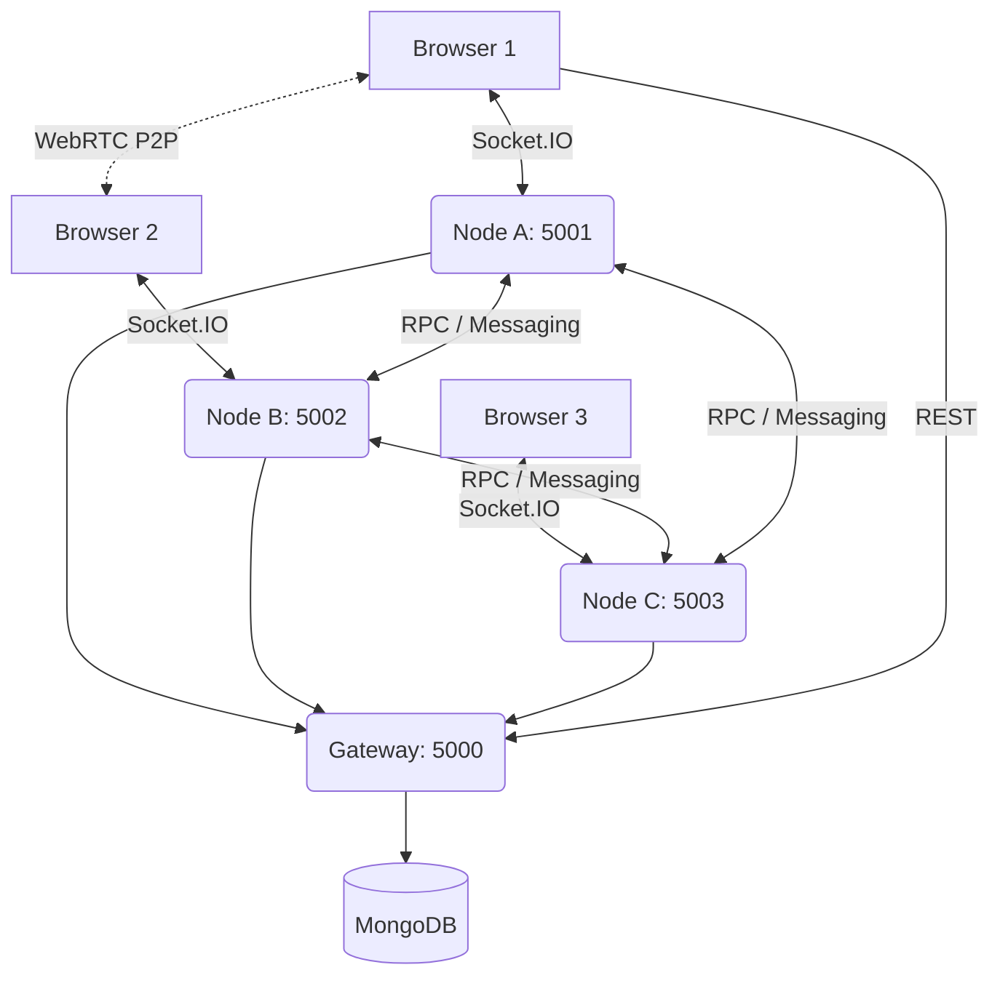

# Distributed Collaborative Study Room

A genuine distributed system demonstrating key concepts such as RPC, Message-Oriented Communication, Stream-Oriented Communication, and P2P Networking using the classic MERN stack.

## Architecture



## Features Demonstrated (FA-1 Syllabus Mapping)
| Syllabus Concept | Implementation |
| --- | --- |
| Distributed System | Independent Gateway, Node A, B, and C Node.js instances |
| Distributed Architecture | Hybrid client-server + P2P |
| RPC | `RpcClient` & `RpcServer` for synchronous node-to-node file lookup |
| Message-Oriented | `MessageBus` for asynchronous pub/sub between nodes |
| Stream-Oriented | `Socket.IO` for real-time browser-to-node streaming |
| P2P Messaging | `PeerManager` for direct backend node-to-node communication |
| WebRTC | True P2P multimedia connection directly between browsers |
| Resource Sharing | Distributed Multer file storage & retrieval via RPC |

### Important Academic Distinction
**RPC (HTTP Request-Response):** The client/node asks for a specific action (e.g. `findResource`), and the server responds. The connection closes after the response.
**Socket.IO/WebSocket Stream:** The connection remains open. The server can continuously push events to clients asynchronously (e.g. `CHAT_MESSAGE`, `USER_JOINED`, `NODE_STATUS_CHANGED`) without the client needing to poll. This is our Unit 2 stream-oriented communication demonstration.

## Setup & Running

1. Install dependencies:
   ```bash
   npm run postinstall
   ```
2. Configure environment (`.env`):
   ```
   GATEWAY_PORT=5000
   VITE_GATEWAY_URL=http://localhost:5000
   ```
3. Start the entire distributed network (Gateway + Node A, B, C + Client):
   ```bash
   npm run dev
   ```

## Demo Guide
1. **Network Topology**: Visit `http://localhost:5173/admin/distributed` to view the Gateway Monitor showing all active nodes.
2. **Room & Chat**: Open two browser windows, join the same room. The chat streams via Socket.IO locally, and Message Bus globally.
3. **WebRTC**: Click "Start Video" in both windows to establish a direct P2P media connection (bypassing the server for media data).
4. **RPC Resource Lookup**: Upload a file as User 1. Note the Node ID. As User 2 (connected to a *different* node), search for the file. Your node will use **RPC** to query the other node, locate the file, and return the remote download URL.
5. **Fault Tolerance**: Kill one of the backend node processes. The Gateway Dashboard will mark it OFFLINE, while other users on other nodes continue their chat and WebRTC streams uninterrupted.
