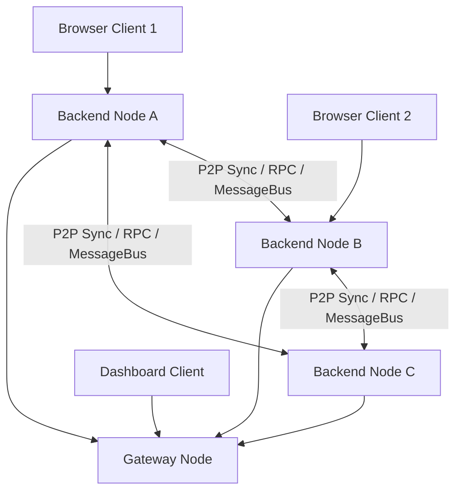
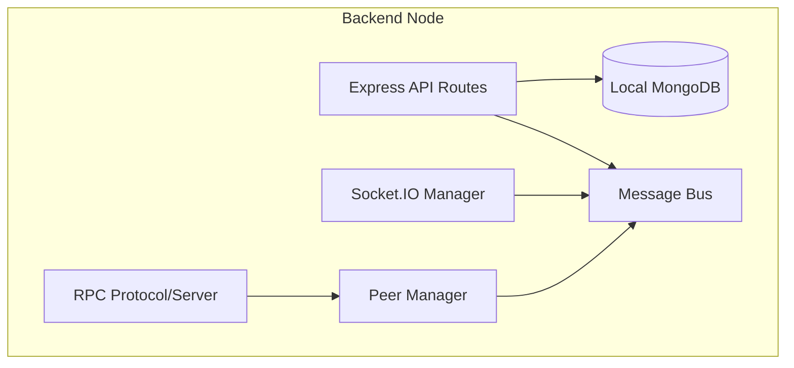
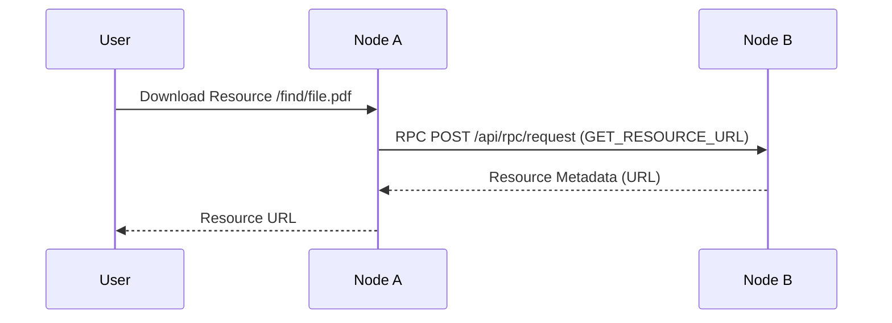
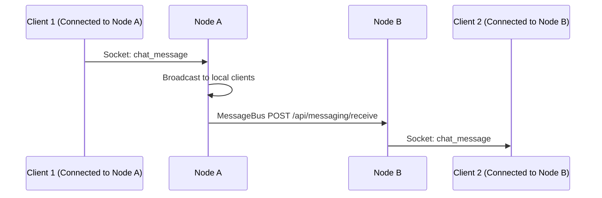
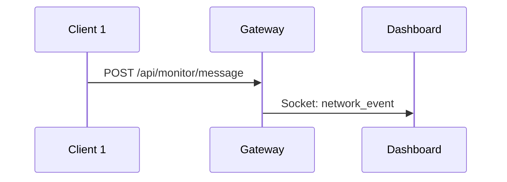
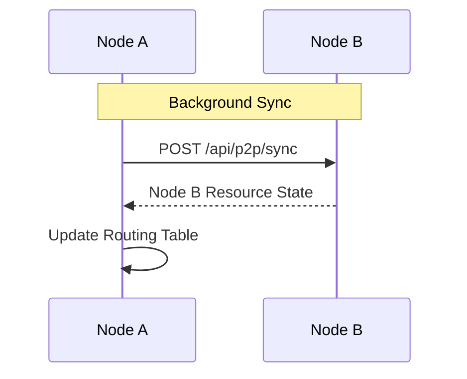
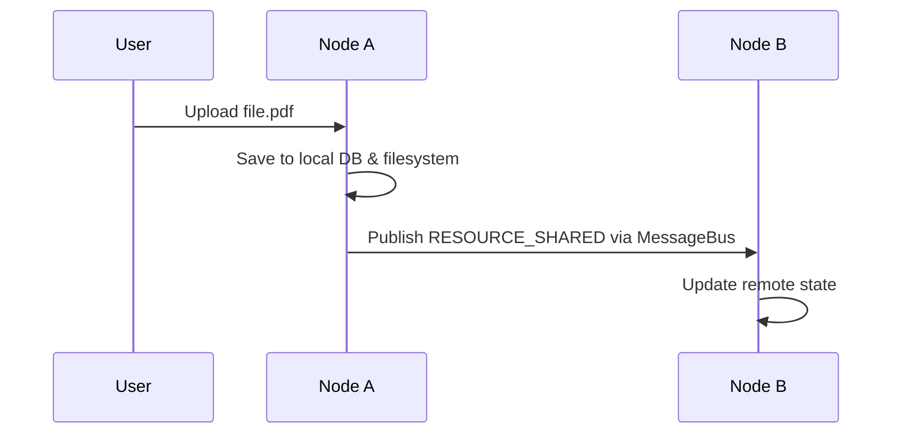
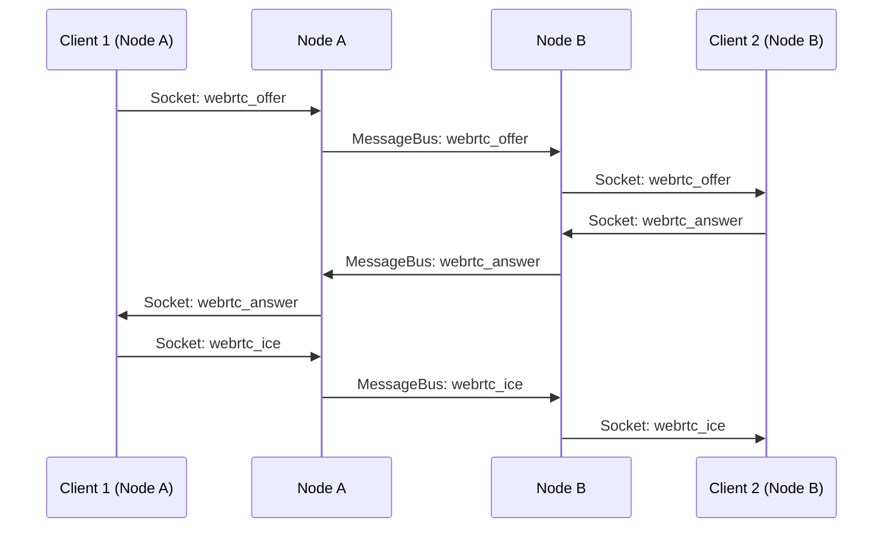
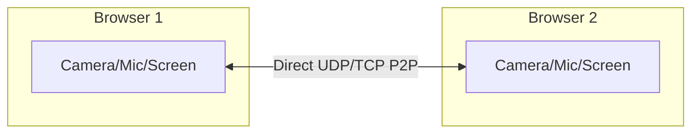
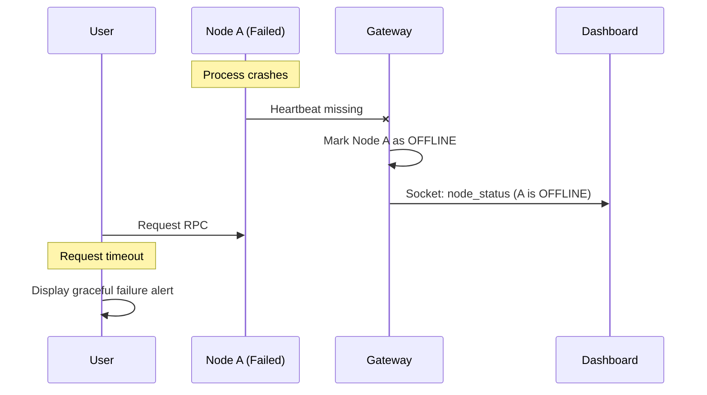

# Project Architecture Documentation

This document contains detailed architectural diagrams representing the FA-Project's distributed system implementation.

## 1. Overall Architecture

## 2. Distributed Node Architecture

## 3. RPC Request/Response (Resource Check)

## 4. Chat Message Propagation

## 5. Stream Communication

## 6. P2P Node Communication

## 7. Distributed Resource Retrieval

## 8. WebRTC Signaling

## 9. WebRTC Peer Connection

## 10. Node Failure Scenario

